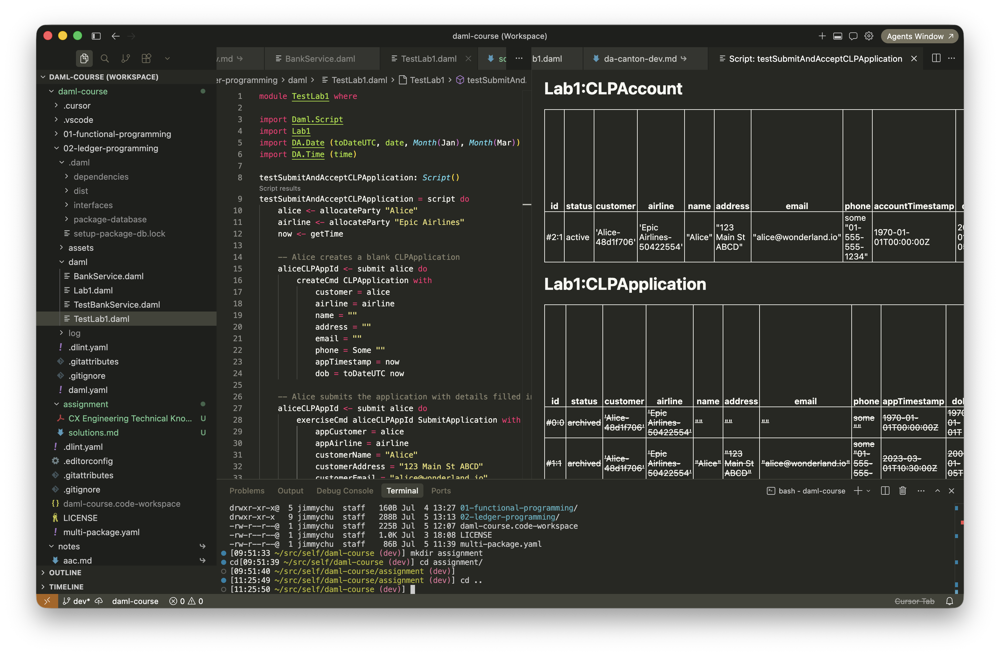
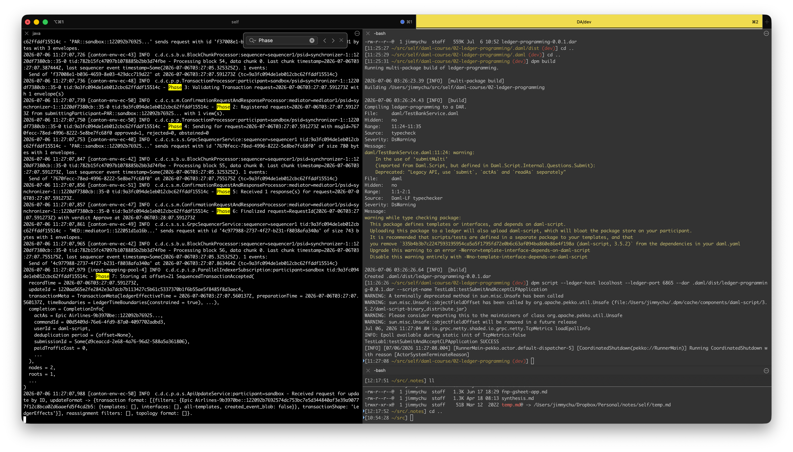

Refer to the [CX engineering technical onboarding](./cx-engin-tech-onboarding.pdf) document.

# Daml Development

## Hands-on: Write your first daml application (build and run with dpm sandbox)

My first application is Ledger Programming Lab 1: [Customer Loyalty Program](https://github.com/jimmychu0807-da/daml-course/blob/main/02-ledger-programming/daml/Lab1.daml), with [test script](https://github.com/jimmychu0807-da/daml-course/blob/main/02-ledger-programming/daml/TestLab1.daml).

Build the daml template with:

```sh
dpm build
```

Most of the time, the vscode `Script Result` is clicked to see a simulated result.

To run it with sandbox, run in one console:

```sh
dpm sandbox -v --debug --dar .daml/dist/ledger-programming-0.0.1.dar
```

Using both the `-v --debug` flags are helpful to see what's going on in the sandbox. The sandbox command spins up a participant `sandbox`, a sequencer `local`, and a mediator `mediator1`.

Open another terminal and run the test script against the sandbox env:

```sh
dpm script --ledger-host localhost --ledger-port 6865 --dar .daml/dist/ledger-programming-0.0.1.dar --script-name TestLab1:testSubmitAndAcceptCLPApplication
```

Beware the script-name is in **moduleName**:**scriptName** format.

## How can you inspect the contents of a DAR? What’s inside?

dar file is in zip format. So just run `unzip file.dar` in cli to unzip the file.

If your machine has java toolchain, use `jar -t` to see the content inside without expansion, or just `jar -x` to extract all files.

The content contains the compiled project module (module.dalf), all the module src files (daml), a manifest file, the compiled daml-stdlib and included modules (*.dalf).

## Hands-on - Test your first daml application with daml script

Running the daml script inside VS Code (I'm using Cursor IDE)



Running with sandbox, run with `-v --debug` flags, each transaction has **7 phases**.



## Theory - what are signatories and observers?

**Signatories** are ones that need to approve in order to create the contract.

**Observers** are ones who have read access to the contract content.

## Hands-on - Implement and test the [propose-accept pattern](https://docs.canton.network/appdev/modules/m2-multi-party-workflows#the-propose-accept-pattern)

- [`ProposeAcceptPattern.daml`](./templates/daml/ProposeAcceptPattern.daml)
- [`TestProposeAcceptPattern.daml`](./templates/daml/TestProposeAcceptPattern.daml)
