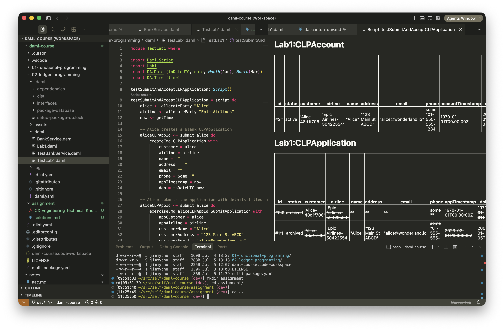
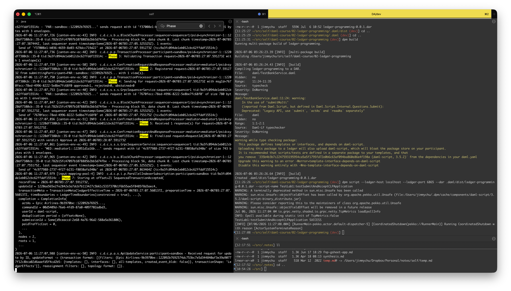
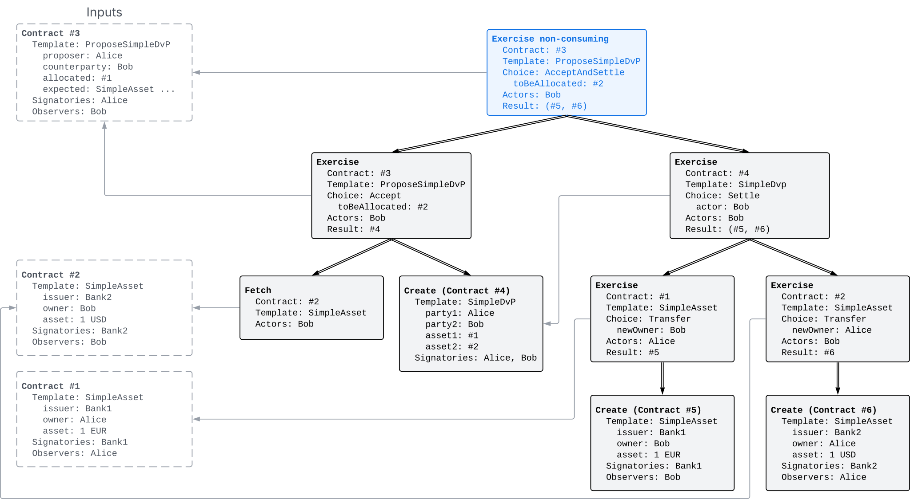

Refer to the [CX engineering technical onboarding](./cx-engin-tech-onboarding.pdf) document.

# Daml Development

## Hands-on: Write your first daml application (build and run with dpm sandbox)

My first application is Ledger Programming Lab 1: [Customer Loyalty Program](https://github.com/jimmychu0807-da/daml-course/blob/main/02-ledger-programming/daml/Lab1.daml), with [test script](https://github.com/jimmychu0807-da/daml-course/blob/main/02-ledger-programming/daml/TestLab1.daml).

Build the daml template with:

```sh
dpm build
```

Most of the time, the vscode `Script Result` is clicked to see a simulated result.

To run it with sandbox, run in one console:

```sh
dpm sandbox -v --debug --dar .daml/dist/ledger-programming-0.0.1.dar
```

Using both the `-v --debug` flags are helpful to see what's going on in the sandbox. The sandbox command spins up a participant `sandbox`, a sequencer `local`, and a mediator `mediator1`.

Open another terminal and run the test script against the sandbox env:

```sh
dpm script --ledger-host localhost --ledger-port 6865 --dar .daml/dist/ledger-programming-0.0.1.dar --script-name TestLab1:testSubmitAndAcceptCLPApplication
```

Beware the script-name is in **moduleName**:**scriptName** format.

## How can you inspect the contents of a DAR? What’s inside?

`dpm inspect-dar <dar-file>`

## Hands-on - Test your first daml application with daml script

Running the daml script inside VS Code (I'm using Cursor IDE)



Running with sandbox, run with `-v --debug` flags, each transaction has **7 phases**.



## Theory - what are signatories and observers?

**Signatories** are ones that need to approve in order to create the contract.

**Observers** are ones who have read access to the contract content.

## Hands-on - Implement and test the [propose-accept pattern](https://docs.canton.network/appdev/modules/m2-multi-party-workflows#the-propose-accept-pattern)

- [`ProposeAcceptPattern.daml`](./templates/daml/ProposeAcceptPattern.daml)
- [`TestProposeAcceptPattern.daml`](./templates/daml/TestProposeAcceptPattern.daml)

## Theory - Consider also [the delegation pattern](https://docs.canton.network/appdev/modules/m2-multi-party-workflows#delegation-patterns). How does it compare to the propose-accept pattern? In which scenarios would you use each pattern?

Propose-accept is used when there is when two parties need to be signatory and is submitting commands asynchronously.

Delegation is used when you are granting a right to another party so they can act on behalf of you i.e. on governance voting. You can also withdraw the granted right afterwards.

But usually I would like such pattern should restrict some actions, or setting the scope of action that delegates can apply to the asset on behalf of the owner.

## Hands-on - Launch [localnet](https://docs.canton.network/appdev/modules/m5-localnet-development)

This is essentially setting up [cn-quickstart](https://github.com/digital-asset/cn-quickstart) project to run locally, and then running `make start`.

Or, run the localnet with localnet-recipes: <https://github.com/DACH-NY/localnet-recipes> with `make start`.

## Hands-on - Deploy your daml project to localnet

Launch the canton console with `make console` using the included docker config.

You could also connect it directly with:

```sh
dpm canton-console --port 2901 --admin-api-port 2902
```
This will just connect the console to the participant node `app-user`.

To connect to `app-provider` use `--port 3901 --admin-api-port 3902`.

The reason using `make console` you see the nice node reference of `app-user`, `app-provider`, `app-mediator`, `sv`, etc is due to the remote console config at: https://github.com/canton-network/splice/blob/15e00f3/cluster/compose/localnet/conf/console/app.conf.

Also note that the release of splice node is at: https://github.com/digital-asset/decentralized-canton-sync

Then you can upload the dar into `app-user` (connects with 2xxx ports) and `app-provider` (connects with 3xxx ports) with:

```
`app-user`.dars.upload("./assignment/templates/.daml/dist/assignment-templates-0.0.1.dar")
```

## Hands-on - Execute a daml transaction between two nodes - app user and app-provider

I followed [the forum post](https://forum.canton.network/t/multi-participant-daml-scripts/7039) and generated the [participant-config.json](https://github.com/jimmychu0807-da/daml-course/blob/main/assignment/multi-participant/participant-config.json) for localnet.

The access_token is generated using `jwt-cli` command based on how [the docker entrypoint initialization](https://github.com/canton-network/splice/blob/main/cluster/compose/localnet/docker/console/entrypoint.sh#L15-L19).

Then there is [the daml script](https://github.com/jimmychu0807-da/daml-course/blob/main/assignment/multi-participant/daml/TestProposeAcceptPattern.daml) that test a propose accept pattern with user creation and submitting to different localnet participant nodes.

There is a neat [Helpers.daml](https://github.com/jimmychu0807-da/daml-course/blob/main/assignment/multi-participant/daml/Helpers.daml) that is written by [Wallace](https://github.com/wallacekelly-da/daml-public-demos/blob/daml-script-participant-config/daml/Helpers.daml) for retrieving and allocating party in a remote participant node and submitting command and polling for completion.

## Theory - What issues arise when scaling a daml project to multiple nodes? How could those issues be mitigated when building a real-world Daml project?

During testing with localnet, I just stop and start the localnet to upload the dar file with the same name and version to multiple participants during the development iteration.

In real-world Daml project, when the testnet is deployed across multiple orgs, they cannot be stop and start at one's will, so one have to increment the dar version during the test iteration so the project code can be accepted.

Also, currently I have hard-coded the ledger user jwt tokens in the participant-config file. In real-world, one would need to query an IAM server to get the necessary user credential to query and submit commands to the testnet.

# Canton Transaction Basics

## Theory - review our documentation on [API user rights](https://docs.digitalasset.com/build/3.4/sdlc-howtos/applications/secure/authorization.html#access-tokens-and-rights)

It use OAuth 2.0 and the access token is issued in the form of jwt.

Encoding signature:

```
{
  "alg": "RS256",
  "typ": "JWT"
}
```
Audience-based tokens

```
{
   "aud": "https://daml.com/jwt/aud/participant/someParticipantId",
   "sub": "someUserId",
   "iss": "someIdpId",
   "exp": 1300819380
}
```
The `aud` and `sub` fields are the required fields. The rest are optional.

## Theory - how does Daml break down a transaction into nodes? What are transaction views? Why does the Daml engine break transactions into sub-transactions?

- https://archived.docs.digitalasset.com/overview/3.4/explanations/ledger-model/ledger-structure.html
- https://docs.daml.com/concepts/ledger-model/ledger-structure.html

- action
- subaction
- transaction: multiple actions taken together

A transaction consists of one or more action node, speicifically on:

- **create**: creating a template. It will has no more subsequent actions.
- **exercise**: exercising a choice on a template, which could cause more action.
- **fetch**: fetching a contract. It will has no more subsequent actions.

So a transaction could form a tree of action node based on the consequences of the root action. An example is shown below, showing the [**ProposeSimpleDvP::AcceptAndSettle**](./templates/daml/LedgerModel.daml) choice.



These actions (the transaction) are perform atomically on the Canton ledger, they either executed successfully altogether or not, there is no partial execution of these action nodes.

Transaction views are also known as transaction projections. They are a subset of the action nodes (sub-tree) which are entitled to be seen by a particular party in a participant node. For a party to be able to see the action, they need to be an informee of the action.

- For **contract** creation: signatory and contract observer are the informees.
- For **consuming** exercise choice: signatory, contract observer, choice controller, choice observer are the informees.
- For **non-consuming** exercise choice: signatory, choice controller, choice observer are the informees.
- For **fetching** action: signatory, choice controller are the informees.

Daml engine breaks them into sub-transaction / transaction projections so these projections are then encrypted and eventually sent to the corresponding participant node to validate. In details, the following happen:

1. The submitting participant node forms all the needed transaction projections (tp), encrypt them, and send them to the sequencer.
2. The sequencer sends these tp to the corresponding participant nodes that host the informee parties.
3. These participant node run the daml model logic and validate the result. The results are sent back to the sequencer.
4. The sequencer forward these result to the mediator to get a final verdict on whether the transaction is valid or not.
5. The verdict, either a **commit** or **reject**, is then return back to the sequencer and get broadcast back to the informee participant nodes.


